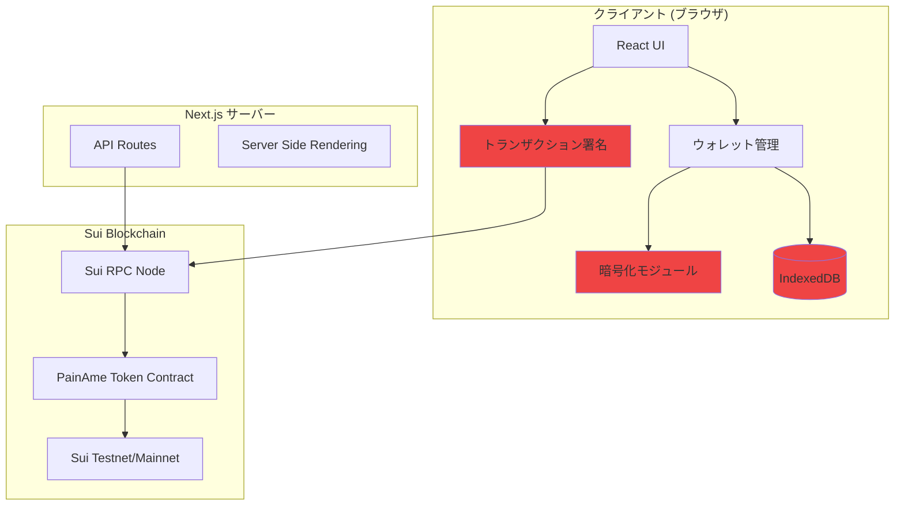
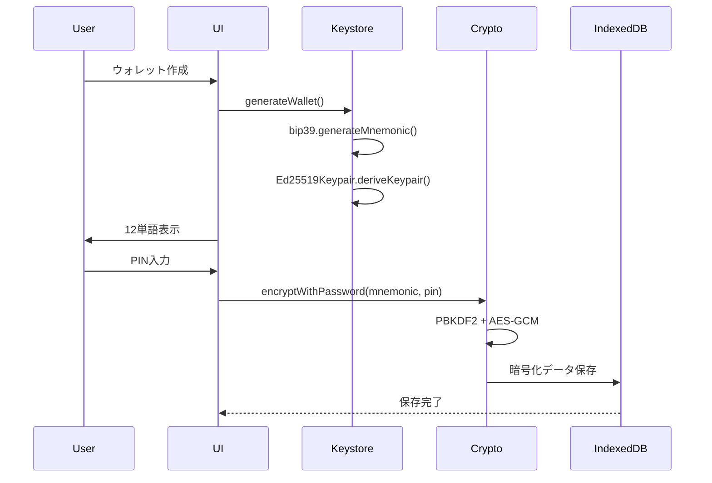
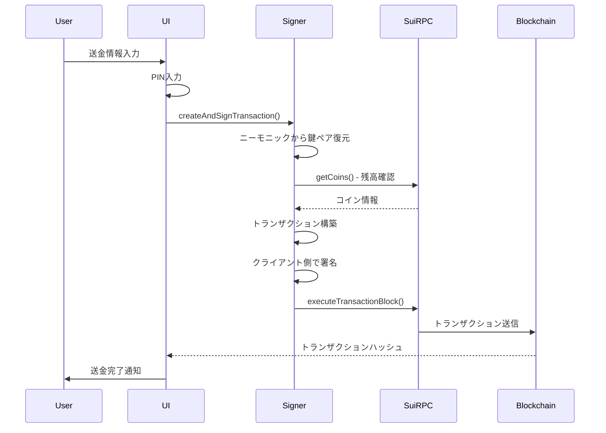
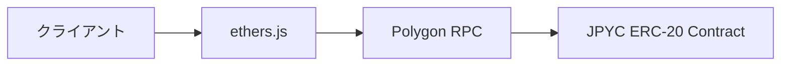

# PaiPay P2P - 技術仕様書 & JPYC移行戦略

**プロジェクト名**: PaiPay P2P (painame-p2p)  
**作成日**: 2025年12月6日  
**バージョン**: v2.0

---

## 📋 目次

1. [プロジェクト概要](#1-プロジェクト概要)
2. [現在の技術仕様](#2-現在の技術仕様)
3. [アーキテクチャ詳細](#3-アーキテクチャ詳細)
4. [セキュリティ実装](#4-セキュリティ実装)
5. [JPYC移行戦略](#5-jpyc移行戦略)
6. [実装フェーズ](#6-実装フェーズ)
7. [リスク評価と対策](#7-リスク評価と対策)
8. [コスト分析](#8-コスト分析)

---

## 1. プロジェクト概要

### 1.1 プロジェクトの目的

PaiPay P2Pは、コミュニティ向けのP2P決済システムテンプレートです。学園祭、地域通貨、サークル内通貨など、あらゆるコミュニティで独自の通貨システムを簡単に構築できるように設計されています。

### 1.2 主要機能

- 🔐 **完全P2P設計**: サーバーに秘密鍵を保存しない安全なアーキテクチャ
- 📱 **モバイル対応**: QRコードによる簡単な送受金
- 🎨 **カスタマイズ可能**: トークン名・色・ロゴを設定ファイルで変更可能
- 🚀 **簡単デプロイ**: Vercel/Netlifyで即座に公開可能
- 💰 **ブロックチェーン**: 高速・低コストなトランザクション

### 1.3 想定ユースケース

| ユースケース | 説明 |
|------------|------|
| 学園祭 | 模擬通貨として使用、出店での決済 |
| 地域通貨 | 地域コミュニティ内での経済活性化 |
| イベント | 期間限定のトークンシステム |
| サークル | グループ内ポイント・報酬システム |
| 小規模ビジネス | 独自の決済・ポイントシステム |

---

## 2. 現在の技術仕様

### 2.1 技術スタック

#### フロントエンド
```typescript
{
  "framework": "Next.js 14.0.4",
  "language": "TypeScript 5.3.3",
  "ui": "React 18.2.0",
  "styling": "Tailwind CSS 3.4.0",
  "pwa": "next-pwa 5.6.0"
}
```

#### ブロックチェーン
```typescript
{
  "blockchain": "Sui Network",
  "network": "Testnet (本番ではMainnet)",
  "sdk": "@mysten/sui 1.37.6",
  "rpcUrl": "https://fullnode.testnet.sui.io:443",
  "token": "PainAme Coin (PAC)",
  "decimals": 6
}
```

#### セキュリティ・暗号化
```typescript
{
  "keyGeneration": "bip39 (12単語ニーモニック)",
  "encryption": "Web Crypto API (AES-GCM 256bit)",
  "keyDerivation": "PBKDF2 (100,000 iterations)",
  "storage": "IndexedDB",
  "signing": "Ed25519 (クライアント側)"
}
```

#### QRコード
```typescript
{
  "scanner": "html5-qrcode 2.3.8",
  "generator": "qrcode 1.5.4"
}
```

### 2.2 プロジェクト構造

```
painame-p2p/
├── src/
│   ├── app/                    # Next.js App Router
│   │   ├── page.tsx           # ホーム画面
│   │   ├── setup/             # ウォレット作成・復元
│   │   ├── wallet/            # ウォレット画面（残高表示）
│   │   ├── send/              # 送金画面
│   │   ├── pin-setup/         # PIN設定
│   │   ├── pin-lock/          # PINロック画面
│   │   ├── debug/             # デバッグツール
│   │   └── api/               # APIルート
│   ├── components/            # Reactコンポーネント
│   │   ├── QRCodeDisplay.tsx  # QRコード表示
│   │   ├── QRScanner.tsx      # QRスキャナー
│   │   ├── QRScannerWrapper.tsx
│   │   └── PINInput.tsx       # PIN入力UI
│   ├── lib/                   # コアロジック
│   │   ├── keystore/          # 鍵管理
│   │   │   ├── generate.ts    # ウォレット生成
│   │   │   ├── mnemonic.ts    # ニーモニック管理
│   │   │   ├── storage.ts     # IndexedDB操作
│   │   │   └── pin.ts         # PINハッシュ化
│   │   ├── crypto/            # 暗号化
│   │   │   └── encryption.ts  # AES-GCM暗号化
│   │   ├── transaction/       # トランザクション
│   │   │   └── client-sign.ts # クライアント側署名
│   │   ├── sui/               # Sui統合
│   │   │   └── client.ts      # Suiクライアント
│   │   ├── painame.ts         # トークン設定
│   │   └── debug/             # デバッグユーティリティ
│   └── config/                # 設定ファイル
│       └── community.ts       # コミュニティ設定
├── public/                    # 静的ファイル
├── SECURITY.md               # セキュリティガイド
├── REQUIREMENTS_V2.md        # 要件定義書
└── README.md                 # 開発者向けドキュメント
```

### 2.3 環境変数

```bash
# .env.local
NEXT_PUBLIC_PAINAME_PACKAGE_ID=0x...        # Suiトークン Package ID
NEXT_PUBLIC_PAINAME_TREASURY_CAP_ID=0x...   # Treasury Cap ID
NEXT_PUBLIC_SUI_NETWORK=testnet             # testnet | mainnet
NEXT_PUBLIC_DISTRIBUTOR_MNEMONIC=...        # テスト用配布元
```

---

## 3. アーキテクチャ詳細

### 3.1 システムアーキテクチャ図



### 3.2 データフロー

#### ウォレット作成フロー



#### 送金フロー（クライアント側署名）



### 3.3 コアモジュール詳細

#### 3.3.1 ウォレット管理 ([`keystore/storage.ts`](file:///Users/seizogakuen/Documents/painame-p2p/src/lib/keystore/storage.ts))

**責務**: ウォレットの暗号化保存・読み込み

```typescript
interface WalletData {
  address: string;              // Suiアドレス
  encryptedMnemonic: string;    // AES-GCM暗号化されたニーモニック
  iv: string;                   // 初期化ベクトル (Base64)
  salt: string;                 // ソルト (Base64)
  pinHash: string;              // PINのSHA-256ハッシュ
  createdAt: number;            // 作成タイムスタンプ
}
```

**主要関数**:
- `saveWallet(address, mnemonic, pin)`: ウォレット保存
- `loadWallet(pin)`: ウォレット読み込み
- `hasWallet()`: ウォレット存在確認
- `deleteWallet()`: ウォレット削除

#### 3.3.2 暗号化 ([`crypto/encryption.ts`](file:///Users/seizogakuen/Documents/painame-p2p/src/lib/crypto/encryption.ts))

**アルゴリズム**: AES-GCM 256bit + PBKDF2

```typescript
// 暗号化パラメータ
const ITERATIONS = 100000;      // PBKDF2反復回数
const KEY_LENGTH = 256;         // AES鍵長
const IV_LENGTH = 12;           // GCM初期化ベクトル長
const SALT_LENGTH = 16;         // ソルト長
```

**主要関数**:
- `encryptWithPassword(plaintext, password)`: 文字列暗号化
- `decryptWithPassword(encrypted, password)`: 文字列復号化

#### 3.3.3 トランザクション署名 ([`transaction/client-sign.ts`](file:///Users/seizogakuen/Documents/painame-p2p/src/lib/transaction/client-sign.ts))

**セキュリティ**: ニーモニックをサーバーに送信しない

```typescript
export async function createAndSignTransaction(params: SendTransactionParams) {
  // 1. ニーモニックから鍵ペア復元（クライアント側）
  const keypair = Ed25519Keypair.deriveKeypair(mnemonic);
  
  // 2. トランザクション構築
  const tx = new Transaction();
  tx.mergeCoins(...);
  tx.splitCoins(...);
  tx.transferObjects(...);
  
  // 3. クライアント側で署名
  const signedTx = await suiClient.signTransactionBlock({
    signer: keypair,
    transactionBlock: tx,
  });
  
  // 4. 署名済みトランザクションのみを返す
  return {
    signedTransaction: signedTx.transactionBlockBytes,
    signature: signedTx.signature,
    fromAddress,
  };
}
```

#### 3.3.4 Suiクライアント ([`sui/client.ts`](file:///Users/seizogakuen/Documents/painame-p2p/src/lib/sui/client.ts))

**責務**: Sui RPCとの通信

```typescript
export const suiClient = new SuiClient({ 
  url: getFullnodeUrl('testnet')
});

// 主要機能
- getBalance(address): 残高取得
- getCoins(owner, coinType): コイン一覧取得
- getTransactionHistory(address): トランザクション履歴取得
- signTransactionBlock(): トランザクション署名
- executeTransactionBlock(): トランザクション実行
```

---

## 4. セキュリティ実装

### 4.1 セキュリティ設計原則

> [!IMPORTANT]
> **Zero Trust Architecture**: サーバーを信頼しない設計

1. **秘密鍵はクライアント側のみ**: サーバーに秘密鍵・ニーモニックを送信しない
2. **クライアント側署名**: すべてのトランザクションはブラウザ内で署名
3. **強力な暗号化**: AES-GCM 256bit + PBKDF2 (100,000 iterations)
4. **PIN保護**: ユーザー設定のPINでウォレットを保護

### 4.2 セキュリティ機能

#### 4.2.1 クライアント側トランザクション署名

**従来の問題点**:
```typescript
// ❌ 危険: ニーモニックをサーバーに送信
fetch('/api/send', {
  body: JSON.stringify({
    mnemonic: wallet.mnemonic,  // ← ネットワーク経由で送信
    toAddress,
    amount,
  })
});
```

**改善後**:
```typescript
// ✅ 安全: クライアント側で署名
const signedTx = await createAndSignTransaction({
  mnemonic,  // ← ブラウザ内でのみ使用
  toAddress,
  amount,
});

fetch('/api/send', {
  body: JSON.stringify({
    signedTransaction: signedTx.signedTransaction,  // ← 署名済みデータのみ
    signature: signedTx.signature,
  })
});
```

#### 4.2.2 強力な暗号化

**開発環境** (デバッグしやすい):
```typescript
security: {
  requirePIN: false,
  showMnemonicInUI: true,
  useStrongEncryption: false,  // シンプルなXOR暗号化
}
```

**本番環境** (セキュア):
```typescript
security: {
  requirePIN: true,
  showMnemonicInUI: false,
  useStrongEncryption: true,   // AES-GCM 256bit
}
```

#### 4.2.3 PIN保護

```typescript
// PIN設定フロー
1. ユーザーが6桁PINを設定
2. PBKDF2でPINをハッシュ化
3. PINでニーモニックを暗号化
4. IndexedDBに保存

// PIN検証フロー
1. ユーザーがPINを入力
2. 保存されたPINハッシュと比較
3. 一致すればニーモニックを復号化
4. ウォレットにアクセス可能
```

### 4.3 セキュリティチェックリスト

本番環境デプロイ前に必ず確認:

- [ ] `security.requirePIN: true`
- [ ] `security.showMnemonicInUI: false`
- [ ] `security.useStrongEncryption: true`
- [ ] HTTPS環境でデプロイ
- [ ] 環境変数が正しく設定されている
- [ ] ニーモニックがネットワークログに出力されていない
- [ ] DevToolsでニーモニックが見えない

---

## 5. JPYC移行戦略

### 5.1 移行の背景と目的

#### 現在の課題

| 課題 | 説明 |
|------|------|
| **独自トークンの管理負担** | Sui上でカスタムトークンを発行・管理する必要がある |
| **流動性の欠如** | PainAmeは独自トークンのため、外部での交換が困難 |
| **ユーザーの理解コスト** | 新しいトークンの概念を理解する必要がある |
| **ブロックチェーンの制約** | Suiエコシステムに依存 |

#### JPYC移行のメリット

| メリット | 説明 |
|---------|------|
| **法定通貨ペッグ** | 1 JPYC = 1 JPY の価値が保証される |
| **既存の流動性** | 既に多くの取引所・サービスで利用可能 |
| **ユーザーの理解容易性** | 日本円と同等の価値で分かりやすい |
| **Polygonの低コスト** | ガス代が非常に安い（数円程度） |
| **EVM互換性** | Ethereumエコシステムとの互換性 |
| **規制対応** | 日本の法規制に準拠したステーブルコイン |

### 5.2 技術的変更点

#### 5.2.1 ブロックチェーン変更

```diff
- Sui Network (Testnet/Mainnet)
+ Polygon Network (Mumbai Testnet / Mainnet)

- Sui RPC: https://fullnode.testnet.sui.io:443
+ Polygon RPC: https://polygon-rpc.com

- SDK: @mysten/sui
+ SDK: ethers.js / viem
```

#### 5.2.2 トークン仕様変更

| 項目 | 現在 (PainAme) | 移行後 (JPYC) |
|------|---------------|--------------|
| **ブロックチェーン** | Sui | Polygon |
| **トークン規格** | Sui Coin | ERC-20 |
| **コントラクトアドレス** | カスタム | 0x6AE7Dfc73E0dDE2aa99ac063DcF7e8A63265108c (Mainnet) |
| **デシマル** | 6 | 18 |
| **シンボル** | PAC | JPYC |
| **名前** | PainAme Coin | JPY Coin |
| **価値** | 独自 | 1 JPYC = 1 JPY |

#### 5.2.3 ウォレット変更

```diff
- Ed25519 鍵ペア (Sui)
+ secp256k1 鍵ペア (Ethereum互換)

- Sui Address (0x... 64文字)
+ Ethereum Address (0x... 40文字)

- ニーモニック: BIP39 (Sui派生パス)
+ ニーモニック: BIP39 (Ethereum派生パス: m/44'/60'/0'/0/0)
```

### 5.3 アーキテクチャ変更

#### 変更前 (Sui)

```mermaid
graph LR
    Client[クライアント] --> SuiSDK[@mysten/sui]
    SuiSDK --> SuiRPC[Sui RPC]
    SuiRPC --> PainAme[PainAme Contract]
```

#### 変更後 (Polygon + JPYC)



### 5.4 必要なコード変更

#### 5.4.1 依存関係の変更

```diff
// package.json
{
  "dependencies": {
-   "@mysten/sui": "^1.37.6",
+   "ethers": "^6.10.0",
+   "viem": "^2.0.0",  // オプション: より軽量
    "bip39": "^3.1.0",  // 変更なし
    "html5-qrcode": "^2.3.8",  // 変更なし
    "qrcode": "^1.5.4",  // 変更なし
  }
}
```

#### 5.4.2 設定ファイルの変更

```typescript
// src/config/community.ts (変更後)
export const COMMUNITY_CONFIG = {
  token: {
    name: 'JPY Coin',
    symbol: 'JPYC',
    decimals: 18,  // ERC-20標準
  },
  
  branding: {
    appName: 'JPYC Pay',
    primaryColor: '#00D395',  // JPYCブランドカラー
    logoUrl: 'https://jpyc.jp/logo.png',
    backgroundColor: '#f0fdf4',
  },
  
  network: {
    type: 'polygon-mainnet' as const,
    chainId: 137,  // Polygon Mainnet
    rpcUrl: 'https://polygon-rpc.com',
    explorerUrl: 'https://polygonscan.com',
  },
  
  jpyc: {
    contractAddress: '0x6AE7Dfc73E0dDE2aa99ac063DcF7e8A63265108c',
    abi: [...],  // ERC-20 ABI
  },
};
```

#### 5.4.3 ウォレット生成の変更

```typescript
// src/lib/keystore/generate.ts (変更後)
import { Wallet, HDNodeWallet } from 'ethers';
import * as bip39 from 'bip39';

export async function generateWallet() {
  // 1. ニーモニック生成（変更なし）
  const mnemonic = bip39.generateMnemonic();
  
  // 2. Ethereum互換ウォレット生成
  const wallet = HDNodeWallet.fromPhrase(mnemonic);
  
  return {
    address: wallet.address,  // 0x... (40文字)
    mnemonic: mnemonic,
    privateKey: wallet.privateKey,
  };
}
```

#### 5.4.4 残高取得の変更

```typescript
// src/lib/polygon/client.ts (新規作成)
import { ethers } from 'ethers';
import { COMMUNITY_CONFIG } from '@/config/community';

const provider = new ethers.JsonRpcProvider(COMMUNITY_CONFIG.network.rpcUrl);

const jpycContract = new ethers.Contract(
  COMMUNITY_CONFIG.jpyc.contractAddress,
  ['function balanceOf(address) view returns (uint256)'],
  provider
);

export async function getBalance(address: string) {
  // MATIC残高（ガス代用）
  const maticBalance = await provider.getBalance(address);
  
  // JPYC残高
  const jpycBalance = await jpycContract.balanceOf(address);
  
  return {
    matic: Number(ethers.formatEther(maticBalance)),
    jpyc: Number(ethers.formatUnits(jpycBalance, 18)),
  };
}
```

#### 5.4.5 送金処理の変更

```typescript
// src/lib/transaction/client-sign.ts (変更後)
import { ethers } from 'ethers';
import { COMMUNITY_CONFIG } from '@/config/community';

export async function createAndSignTransaction(params: SendTransactionParams) {
  const { mnemonic, toAddress, amount } = params;
  
  // 1. ウォレット復元
  const wallet = ethers.Wallet.fromPhrase(mnemonic);
  const provider = new ethers.JsonRpcProvider(COMMUNITY_CONFIG.network.rpcUrl);
  const signer = wallet.connect(provider);
  
  // 2. JPYCコントラクト
  const jpycContract = new ethers.Contract(
    COMMUNITY_CONFIG.jpyc.contractAddress,
    [
      'function transfer(address to, uint256 amount) returns (bool)',
      'function balanceOf(address) view returns (uint256)',
    ],
    signer
  );
  
  // 3. 残高確認
  const balance = await jpycContract.balanceOf(wallet.address);
  const amountWei = ethers.parseUnits(amount.toString(), 18);
  
  if (balance < amountWei) {
    throw new Error('残高が不足しています');
  }
  
  // 4. トランザクション作成・署名
  const tx = await jpycContract.transfer(toAddress, amountWei);
  
  // 5. トランザクション送信
  const receipt = await tx.wait();
  
  return {
    txHash: receipt.hash,
    explorerUrl: `${COMMUNITY_CONFIG.network.explorerUrl}/tx/${receipt.hash}`,
  };
}
```

### 5.5 JPYC コントラクト情報

#### Polygon Mainnet

```typescript
{
  "contractAddress": "0x6AE7Dfc73E0dDE2aa99ac063DcF7e8A63265108c",
  "chainId": 137,
  "decimals": 18,
  "symbol": "JPYC",
  "name": "JPY Coin",
  "rpcUrl": "https://polygon-rpc.com",
  "explorerUrl": "https://polygonscan.com"
}
```

#### Mumbai Testnet (テスト用)

```typescript
{
  "contractAddress": "0x...",  // テスト用JPYCコントラクト
  "chainId": 80001,
  "decimals": 18,
  "symbol": "JPYC",
  "name": "JPY Coin (Testnet)",
  "rpcUrl": "https://rpc-mumbai.maticvigil.com",
  "explorerUrl": "https://mumbai.polygonscan.com"
}
```

> [!WARNING]
> Mumbai Testnetは2024年4月に廃止予定です。代わりにAmoy Testnetを使用してください。

---

## 6. 実装フェーズ

### Phase 1: 調査・準備 (1-2日)

#### タスク
- [ ] JPYC公式ドキュメント確認
- [ ] Polygon RPCエンドポイント選定
- [ ] ethers.js / viem の選定
- [ ] テスト用JPYC取得方法の確認
- [ ] 既存ウォレットの移行方法検討

#### 成果物
- 技術調査レポート
- 移行計画書
- リスク評価書

### Phase 2: 開発環境構築 (1日)

#### タスク
- [ ] 依存関係のインストール
- [ ] Polygon Testnet接続確認
- [ ] テスト用ウォレット作成
- [ ] テスト用JPYC取得

#### 検証
```bash
# 依存関係インストール
npm install ethers@^6.10.0

# テスト用ウォレット作成
node scripts/create-test-wallet.js

# Polygon接続確認
node scripts/test-polygon-connection.js
```

### Phase 3: コア機能実装 (3-5日)

#### 3.1 ウォレット管理

**変更ファイル**:
- [`src/lib/keystore/generate.ts`](file:///Users/seizogakuen/Documents/painame-p2p/src/lib/keystore/generate.ts)
- [`src/lib/keystore/mnemonic.ts`](file:///Users/seizogakuen/Documents/painame-p2p/src/lib/keystore/mnemonic.ts)

**変更内容**:
```typescript
// Sui → Ethereum互換ウォレット生成
- Ed25519Keypair.deriveKeypair()
+ HDNodeWallet.fromPhrase()
```

#### 3.2 Polygonクライアント

**新規ファイル**:
- `src/lib/polygon/client.ts`
- `src/lib/polygon/jpyc.ts`

**実装内容**:
- ethers.js プロバイダー設定
- JPYCコントラクトインターフェース
- 残高取得関数
- トランザクション履歴取得

#### 3.3 トランザクション署名

**変更ファイル**:
- [`src/lib/transaction/client-sign.ts`](file:///Users/seizogakuen/Documents/painame-p2p/src/lib/transaction/client-sign.ts)

**変更内容**:
```typescript
// Sui Transaction → ERC-20 Transfer
- new Transaction()
- tx.mergeCoins()
- tx.splitCoins()
- tx.transferObjects()
+ jpycContract.transfer(to, amount)
```

#### 3.4 UI更新

**変更ファイル**:
- [`src/app/wallet/page.tsx`](file:///Users/seizogakuen/Documents/painame-p2p/src/app/wallet/page.tsx)
- [`src/app/send/page.tsx`](file:///Users/seizogakuen/Documents/painame-p2p/src/app/send/page.tsx)
- [`src/config/community.ts`](file:///Users/seizogakuen/Documents/painame-p2p/src/config/community.ts)

**変更内容**:
- トークン名: PainAme → JPYC
- デシマル: 6 → 18
- ガス代表示: SUI → MATIC
- エクスプローラーリンク: Sui → Polygon

### Phase 4: テスト (2-3日)

#### 4.1 単体テスト

```typescript
// tests/wallet.test.ts
describe('Wallet Generation', () => {
  it('should generate Ethereum-compatible wallet', async () => {
    const wallet = await generateWallet();
    expect(wallet.address).toMatch(/^0x[a-fA-F0-9]{40}$/);
  });
});

// tests/jpyc.test.ts
describe('JPYC Balance', () => {
  it('should fetch JPYC balance', async () => {
    const balance = await getBalance(TEST_ADDRESS);
    expect(balance.jpyc).toBeGreaterThanOrEqual(0);
  });
});
```

#### 4.2 統合テスト

**テストシナリオ**:
1. ウォレット作成
2. テスト用JPYC受け取り
3. 別アドレスへ送金
4. 残高確認
5. トランザクション履歴確認

#### 4.3 E2Eテスト

**ブラウザテスト**:
- [ ] ウォレット作成フロー
- [ ] QRコード受取
- [ ] QRコードスキャン送金
- [ ] PIN設定・ロック
- [ ] モバイルブラウザ動作確認

### Phase 5: デプロイ・移行 (1-2日)

#### 5.1 環境変数設定

```bash
# Vercel / Netlify
NEXT_PUBLIC_JPYC_CONTRACT_ADDRESS=0x6AE7Dfc73E0dDE2aa99ac063DcF7e8A63265108c
NEXT_PUBLIC_POLYGON_NETWORK=mainnet
NEXT_PUBLIC_POLYGON_RPC_URL=https://polygon-rpc.com
NEXT_PUBLIC_POLYGON_CHAIN_ID=137
```

#### 5.2 既存ユーザーの移行

> [!CAUTION]
> 既存のSuiウォレットは使用できなくなります

**移行方法**:
1. 既存ウォレットのニーモニックをバックアップ
2. 新しいPolygon対応ウォレットを作成
3. 必要に応じて資産を移行（手動）

**移行ツール** (オプション):
```typescript
// scripts/migrate-wallet.ts
// Suiニーモニック → Polygonウォレット変換ツール
```

#### 5.3 本番デプロイ

```bash
# ビルド確認
npm run build

# Vercelデプロイ
vercel --prod

# 動作確認
- ウォレット作成
- JPYC受け取り
- JPYC送金
- トランザクション確認
```

---

## 7. リスク評価と対策

### 7.1 技術的リスク

| リスク | 影響度 | 確率 | 対策 |
|--------|--------|------|------|
| **Polygon RPC障害** | 高 | 中 | 複数のRPCエンドポイントを用意 |
| **JPYC流動性不足** | 中 | 低 | 事前に取引所で確認 |
| **ガス代高騰** | 中 | 低 | Polygonは通常低コスト、監視を実施 |
| **スマートコントラクトバグ** | 高 | 低 | JPYC公式監査済みコントラクトを使用 |
| **ウォレット移行失敗** | 高 | 中 | 十分なテスト期間を設ける |

### 7.2 ビジネスリスク

| リスク | 影響度 | 確率 | 対策 |
|--------|--------|------|------|
| **ユーザーの混乱** | 中 | 高 | 詳細な移行ガイド作成 |
| **既存ユーザーの離脱** | 中 | 中 | 移行インセンティブ提供 |
| **規制変更** | 高 | 低 | JPYC公式の規制対応状況を監視 |

### 7.3 セキュリティリスク

| リスク | 影響度 | 確率 | 対策 |
|--------|--------|------|------|
| **フィッシング攻撃** | 高 | 中 | ユーザー教育、公式ドメイン明示 |
| **秘密鍵漏洩** | 高 | 低 | クライアント側署名の徹底 |
| **中間者攻撃** | 高 | 低 | HTTPS必須、証明書検証 |

---

## 8. コスト分析

### 8.1 開発コスト

| 項目 | 工数 | 備考 |
|------|------|------|
| 調査・準備 | 1-2日 | JPYC仕様確認、技術選定 |
| 開発環境構築 | 1日 | 依存関係、テスト環境 |
| コア機能実装 | 3-5日 | ウォレット、送金、UI |
| テスト | 2-3日 | 単体、統合、E2E |
| デプロイ・移行 | 1-2日 | 本番環境、ユーザー移行 |
| **合計** | **8-13日** | 1人のエンジニアの場合 |

### 8.2 運用コスト

#### Sui (現在)

| 項目 | コスト |
|------|--------|
| トランザクション手数料 | 約0.001 SUI/tx (約0.1円) |
| RPCノード | 無料 (公式RPC使用) |
| トークン発行・管理 | 初期コストあり |

#### Polygon + JPYC (移行後)

| 項目 | コスト |
|------|--------|
| トランザクション手数料 | 約0.001 MATIC/tx (約0.1円) |
| RPCノード | 無料 (公式RPC使用) |
| トークン発行・管理 | 不要 (JPYC使用) |

> [!TIP]
> ガス代はほぼ同等ですが、トークン管理コストが削減されます

### 8.3 ユーザーコスト

| 項目 | Sui (現在) | Polygon + JPYC (移行後) |
|------|-----------|----------------------|
| **ウォレット作成** | 無料 | 無料 |
| **送金手数料** | 約0.1円 | 約0.1円 |
| **JPYC購入** | - | 取引所手数料 (0.1-1%) |
| **JPYC換金** | - | 取引所手数料 (0.1-1%) |

---

## 9. まとめ

### 9.1 現在のシステムの強み

- ✅ **セキュア**: クライアント側署名、AES-GCM暗号化
- ✅ **P2P**: サーバーに秘密鍵を保存しない
- ✅ **カスタマイズ可能**: 設定ファイルで簡単に変更
- ✅ **モバイル対応**: QRコードで簡単送受金
- ✅ **低コスト**: Suiの高速・低コストトランザクション

### 9.2 JPYC移行の推奨理由

1. **法定通貨ペッグ**: 1 JPYC = 1 JPY で価値が安定
2. **既存の流動性**: 取引所で簡単に売買可能
3. **ユーザーの理解容易性**: 日本円と同等で分かりやすい
4. **Polygonの低コスト**: ガス代が非常に安い
5. **規制対応**: 日本の法規制に準拠

### 9.3 次のステップ

1. **Phase 1**: JPYC公式ドキュメント確認、技術調査
2. **Phase 2**: 開発環境構築、Polygon接続確認
3. **Phase 3**: コア機能実装（ウォレット、送金、UI）
4. **Phase 4**: テスト（単体、統合、E2E）
5. **Phase 5**: 本番デプロイ、ユーザー移行

---

## 付録

### A. 参考リンク

- [JPYC公式サイト](https://jpyc.jp/)
- [Polygon公式ドキュメント](https://docs.polygon.technology/)
- [ethers.js ドキュメント](https://docs.ethers.org/)
- [ERC-20 標準仕様](https://eips.ethereum.org/EIPS/eip-20)

### B. 用語集

| 用語 | 説明 |
|------|------|
| **JPYC** | 日本円ペッグのステーブルコイン (1 JPYC = 1 JPY) |
| **Polygon** | Ethereumのレイヤー2スケーリングソリューション |
| **ERC-20** | Ethereumトークンの標準規格 |
| **AES-GCM** | 認証付き暗号化アルゴリズム |
| **PBKDF2** | パスワードベース鍵導出関数 |
| **BIP39** | ニーモニックフレーズの標準規格 |

---

**作成者**: Antigravity AI  
**最終更新**: 2025年12月6日
